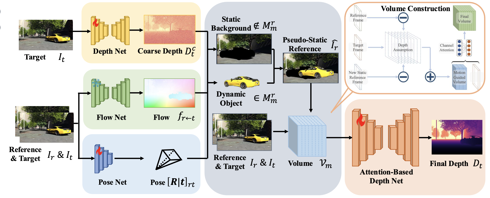

# Manydepth2: Motion-Aware Self-Supervised Monocular Depth Estimation in Dynamic Scenes

[[Link to paper]](https://arxiv.org/abs/2312.15268)

We introduce ***Manydepth2***, a Motion-Guided Depth Estimation Network, to achieve precise monocular self-supervised depth estimation for both dynamic objects and static backgrounds

[](https://paperswithcode.com/sota/camera-pose-estimation-on-kitti-odometry?p=mgdepth-motion-guided-cost-volume-for-self)

[](https://paperswithcode.com/sota/monocular-depth-estimation-on-cityscapes?p=mgdepth-motion-guided-cost-volume-for-self)

[](https://paperswithcode.com/sota/monocular-depth-estimation-on-kitti-eigen-1?p=mgdepth-motion-guided-cost-volume-for-self)

* ✅ **Self-supervised**: We train from monocular video only. No depths or poses are needed at training or test time.
* ✅ **Accurate**: Accurate depth estimation for both dynamic objects and static background.
* ✅ **Efficient**: Only one forward pass at test time. No test-time optimization needed.
* ✅ **State-of-the-art** Self-supervised monocular-trained depth estimation on KITTI.

## Overview

Manydepth constructs the cost volume using both the reference and target frames, but it overlooks the dynamic foreground, which can lead to significant errors when handling dynamic objects:

<p align="center">
  
</p>

This phenomenon arises from the fact that real optical flow consists of both static and dynamic components. To construct an accurate cost volume for depth estimation, it is essential to extract the static flow. The entire pipeline of our approach can be summarized as follows:

<p align="center">
  
</p>


In our paper, we:

* Propose a method to construct a static reference frame using optical flow to mitigate the impact of dynamic objects.
* Build a motion-aware cost volume leveraging the static reference frame.
* Integrate High-Resolution Representation Learning into the framework to enhance performance further.

Our contributions enable accurate depth estimation on both the KITTI and Cityscapes datasets:

### Predicted Depth Maps on KITTI:
<p align="center">
  
</p>

### Error Map for Predicted Depth Maps on Cityscapes:

<p align="center">
  
</p>


## ✏️ 📄 Citation

If you find our work useful or interesting, please cite our paper:

```latex
Manydepth2: Motion-Aware Self-Supervised Monocular Depth Estimation in Dynamic Scenes

Kaichen Zhou, Jia-Wang Bian, Qian Xie, Jian-Qing Zheng, Niki Trigoni, Andrew Markham 
```

## 📈 Results

Our **ManyDepth2** method outperforms all previous methods in all subsections across most metrics with the same input size, whether or not the baselines use multiple frames at test time. See our paper for full details.

<p align="center">
  
</p>

## 💾 Dataset Preparation

For instructions on downloading the KITTI dataset, see [Monodepth2](https://github.com/nianticlabs/monodepth2)

Make sure you have first run `export_gt_depth.py` to extract ground truth files.

You can also download it from this link [KITTI_GT](https://drive.google.com/file/d/19lGwLoWgWtzcd-ZCB_NK6TsJfrRU1ZPg/view?usp=drive_link)

## 👀 Reproducing Paper Results

### Prerequisite
To replicate the results from our paper, please first create and activate the provided environment:
```
conda env create -f environment.yaml
```
Once all packages have been installed successfully, please execute the following command:
```
conda activate manydepth2
```
Next, please download and install the pretrained FlowNet weights using this [Weights For GMFLOW](https://drive.google.com/file/d/1tfHRRO-WiL7Lvva4ZCOAjSVxM4glq_ws/view?usp=drive_link). And place it under ```/pretrained```.

### Training
After finishing the dataset and environment preparation, please run:

```bash
sh train_many2.sh
```

To reproduce the results on Cityscapes, we froze the teacher model at the 5th epoch and set the height to 192 and width to 512.

### Testing

To evaluate a model on KITTI, run:

```bash
sh eval_many2.sh
```

## 👀 Reproducing Baseline Results
Running Manydepth:
```bash
sh train_many.sh
```

To evaluate Manydepth on KITTI, run:
```bash
sh eval_many.sh
```


## 💾 Pretrained Weights
You can download the weights for several pretrained models here and save them in the following directory:
```
--logs
  --models_many
    --...
  --models_many2
    --...
```

* [KITTI MR (640x192) Manydepth](https://drive.google.com/drive/folders/1WM-At9UPNs1JSyHRyV_4MBuooQki9A7H?usp=drive_link)
* [KITTI MR (640x192) Manydepth2](https://drive.google.com/drive/folders/1mUlairBiKRm8IWXV2O2a5_cGzQwBC3RC?usp=drive_link)

## 🖼 Acknowledgement
Great Thank to [Manydepth](https://github.com/nianticlabs/manydepth).
